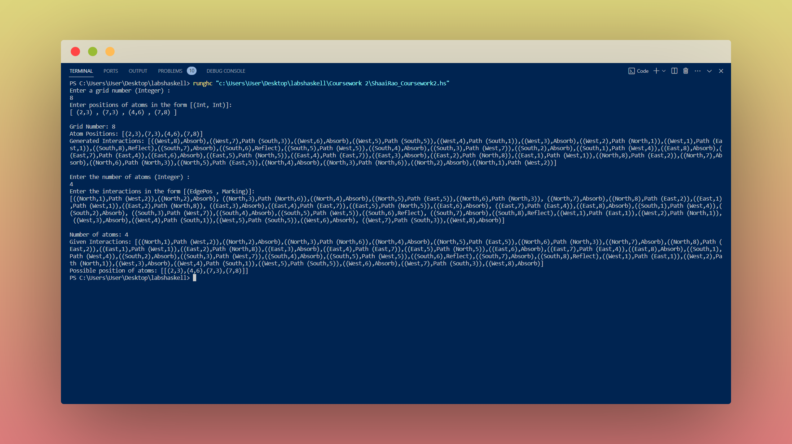

# Black Box Game


Black Box Game is a digital adaptation of the classic board game "Black Box." In this game, players are presented with an N x N grid containing hidden "atoms". The objective is to deduce the location of these atoms by firing rays into the grid from its edges. The path of each ray is determined by specific rules:

- Rays travel in straight lines through the grid unless obstructed by an atom.
- A ray absorbed by an atom takes priority over any deflections or reflections.
- When a ray strikes an atom's corner, it is deflected by 90 degrees away from the atom.
- A ray exiting the grid at the same point it entered is considered reflected, which can occur through a series of deflections or special cases like edge reflections and double deflections.

To learn more about the gameplay and rules of Black Box, refer to  [this video](https://www.youtube.com/watch?v=aF9OU1_Bi4g).

## Optimization in the project 

- Created an enhanced ray tracing algorithm in Haskell which improved the performance by 75% for accurately modeling light interactions on a grid.
- This algorithm also efficiently reduces computational steps by over 470,000 for a 64-grid with 4 atom interactions.
- Through recursive techniques and algorithmic optimizations, the algorithm seamlessly handles various atom configurations on grids of any size, ensuring precise representation of specified light ray interactions.

For the detailed information about the implementation, please refer to the ShaaiRao_BlackBox_Github.pdf . Refer to page 18 for the optimization calculation. 

## Run Locally 

1) Clone the project 

```bash
  git clone https://github.com/ShaaiRao03/black-box-game.git 
```

2) Install GHcup in Powershell from https://www.haskell.org/ghcup/install/

2) Go to VS code and install the following extensions :

- Haskell
- Haskell Syntax Highlighting
- Haskell GHCi Debug Adapter

3) Close VS Code and reopen again

4) Now , you can directly run the file 
